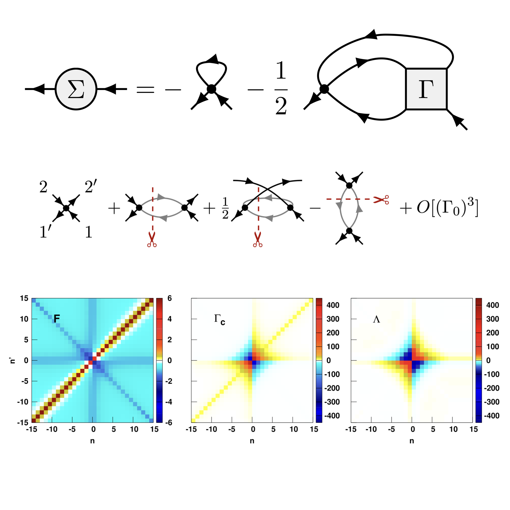

<div align="center">

# TwoParticleQFT

**An open, community-editable reference for two-particle quantities in quantum field theory**

*Definitions, conventions, diagrammatics, and the technical derivations that papers usually leave out — with a focus on strongly correlated electron systems.*

[**📖 Read it online**](https://nepomukritz.github.io/TwoParticleQFT/) &nbsp;·&nbsp;
[Symbols &amp; notations](https://nepomukritz.github.io/TwoParticleQFT/symbols-and-notations) &nbsp;·&nbsp;
[Contribute](#contributing)

[](https://nepomukritz.github.io/TwoParticleQFT/)
[](https://github.com/NepomukRitz/TwoParticleQFT/actions/workflows/deploy.yml)
[](https://next.jupyterbook.org/)
[](LICENSE)
[](#contributing)



</div>

---

## About

Two-particle quantities — vertices, four-point functions, susceptibilities — sit at the heart of the theory of strongly correlated electrons, from the Bethe–Salpeter and parquet equations to modern diagrammatic extensions of dynamical mean-field theory. Unfortunately, there is a vast body of literature on them, and **different communities use different (and often mutually incompatible) conventions and notations — sometimes even from paper to paper.** This is a perennial source of confusion, and [the main motivation](https://xkcd.com/927) for this project.

**TwoParticleQFT** is a documentation site that aims to:

- lay out the **fundamental definitions** of two-particle quantities from a single, self-consistent set of conventions;
- present the **diagrammatic frameworks** (parquet theory, single-boson exchange) built on top of them;
- work through the **technical derivations** that are usually omitted from papers "for the sake of brevity"; and
- **explicitly cross-reference competing conventions** in the literature (e.g. the "Vienna" vs. "Munich" conventions, and the differing channel labelings) so results can be translated between them.

The rendered site lives at **<https://nepomukritz.github.io/TwoParticleQFT/>**.

## What's inside

The content is written in [MyST Markdown](https://mystmd.org/) and organized into the sections below (see [`myst.yml`](myst.yml) for the full table of contents).

| | Page | Focus |
|---|---|---|
| | [**Symbols and notations**](https://nepomukritz.github.io/TwoParticleQFT/symbols-and-notations) | Lookup tables for every object used on the site, each cross-listed against its common synonyms in the literature. |
| **Definitions** | [Starting point](https://nepomukritz.github.io/TwoParticleQFT/starting-point) | The imaginary-time action, the bare propagator, and the antisymmetrized quartic interaction in **Hugenholtz notation**. |
| | [Basic definitions](https://nepomukritz.github.io/TwoParticleQFT/basic-definitions) | Propagator, self-energy, four-point correlation function, and the four-point vertex, with the index-ordering conventions used throughout. |
| | [Two-particle channels](https://nepomukritz.github.io/TwoParticleQFT/two-particle-channels) | Two-particle reducibility and the three channels (pp, ph, ph̄); connectors, channel identity operators, and bubbles. |
| | [Frequency parametrizations](https://nepomukritz.github.io/TwoParticleQFT/frequency-parametrizations) | Choosing the independent frequency/momentum arguments; channel-native parametrizations that diagonalize bubble contractions. |
| | [Spin parametrizations](https://nepomukritz.github.io/TwoParticleQFT/spin-parametrizations) | SU(2) spin structure; the magnetic/density and singlet/triplet bases. |
| **Diagrammatic frameworks** | [Parquet theory](https://nepomukritz.github.io/TwoParticleQFT/parquet-theory) | Parquet decomposition, Bethe–Salpeter and Schwinger–Dyson equations, and the parquet approximation. |
| | [Single boson exchange](https://nepomukritz.github.io/TwoParticleQFT/single-boson-exchange) | The SBE decomposition, Hedin vertices, the screened interaction, and the SBE approximation (with GW as a limit). |
| **Advanced topics** | [Keldysh formalism](https://nepomukritz.github.io/TwoParticleQFT/keldysh-formalism) | Two-particle QFT on the real-frequency Keldysh contour: index structure, the Keldysh rotation, and component Dyson equations. |
| | [w2dynamics conventions](https://nepomukritz.github.io/TwoParticleQFT/w2dynamics) | The frequency conventions and definitions of the [w2dynamics](https://github.com/w2dynamics/w2dynamics) impurity solver — one- and two-particle Green's functions, channel parametrizations, and crossing symmetries — and how they relate to the Vienna/Munich conventions. |

### Highlights

- 🧭 **One consistent convention**, with explicit translation notes to the "Vienna" and "Munich" conventions, to the various channel labelings used across communities, and to the conventions of specific codes (e.g. the [w2dynamics](https://nepomukritz.github.io/TwoParticleQFT/w2dynamics) impurity solver).
- ✏️ **Hugenholtz (antisymmetrized-vertex) diagrammatics** used from the ground up to unify direct and exchange scattering.
- 🌡️ **Both formalisms**: the imaginary-time Matsubara formalism *and* the real-frequency Keldysh formalism.
- 🧮 **Worked examples** (e.g. the Hubbard model) and **collapsible step-by-step derivations** of results that are normally quoted without proof.
- 🖼️ Diagrams and figures for propagators, vertices, bubbles, and the parquet/SDE relations.

> [!NOTE]
> The site is under active construction — several pages carry visible "to do" notes marking derivations still to be filled in or expanded. See the [wishlist](https://nepomukritz.github.io/TwoParticleQFT/#wishlist) for the current priorities.

## Building the site locally

The site is a [Jupyter Book 2 / MyST](https://next.jupyterbook.org/) project. You only need the `jupyter-book` CLI; a recent Node.js is bundled/bootstrapped for you either way.

**Option A — Python (pip):**

```bash
pip install jupyter-book        # provides the v2 (MyST) CLI, ≥ 2.1.0
```

**Option B — Node (npm), matching the CI:**

```bash
npm install -g jupyter-book
```

Then, from the repository root:

```bash
# Live preview with hot reload
jupyter-book start

# Or produce a static HTML build in _build/html
jupyter-book build --html
```

The deployment to GitHub Pages is fully automated: every push to `main` triggers the [`deploy.yml`](.github/workflows/deploy.yml) workflow, which builds the HTML and publishes it to Pages.

## Repository layout

```
TwoParticleQFT/
├── myst.yml                 # MyST project config + table of contents
├── src/
│   ├── intro.md             # Landing page
│   ├── symbols_and_notations.md
│   ├── starting_point.md
│   ├── basic_definitions.md
│   ├── two-particle-channels.md
│   ├── frequency_parametrizations.md
│   ├── spin_parametrizations.md
│   ├── parquet_theory.md
│   ├── single_boson_exchange.md
│   ├── keldysh_formalism.md
│   ├── w2dynamics.md
│   ├── diagrams/            # Feynman diagrams (SVG/PNG)
│   └── images/              # Title image, logo
├── Vertex_conventions.pdf   # Supplementary notes on vertex conventions
├── .github/workflows/       # GitHub Pages deployment
└── LICENSE
```

## Contributing

**This site is editable by anyone, and contributions are very welcome!** Whether you have found a typo or a sign error, want to clarify a convention, or would like to add a whole new section, please open an issue or a pull request.

Good places to start:

- the **[wishlist](https://nepomukritz.github.io/TwoParticleQFT/#wishlist)** of planned sections and improvements;
- the **"to do"** admonitions scattered throughout the individual pages, marking derivations and references still to be added.

To preview your changes, edit the relevant Markdown file under [`src/`](src/) and run `jupyter-book start` (see [above](#building-the-site-locally)).

## License

Released under the [MIT License](LICENSE). © 2025 Nepomuk Ritz.

## Citation

If this reference is useful for your work, a link back to the site is appreciated:

> N. Ritz, *TwoParticleQFT — Open review of definitions, conventions and equations for two-particle quantum field theory.* <https://nepomukritz.github.io/TwoParticleQFT/>
